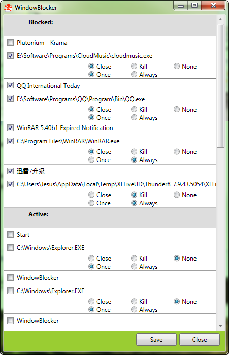

# WindowBlocker

Simple program that can simply remember and close windows without killing off the process.

Note: It starts main loop after a fixed 15 seconds delay. This is an ugly hack to make programs finish loading on windows startup.

